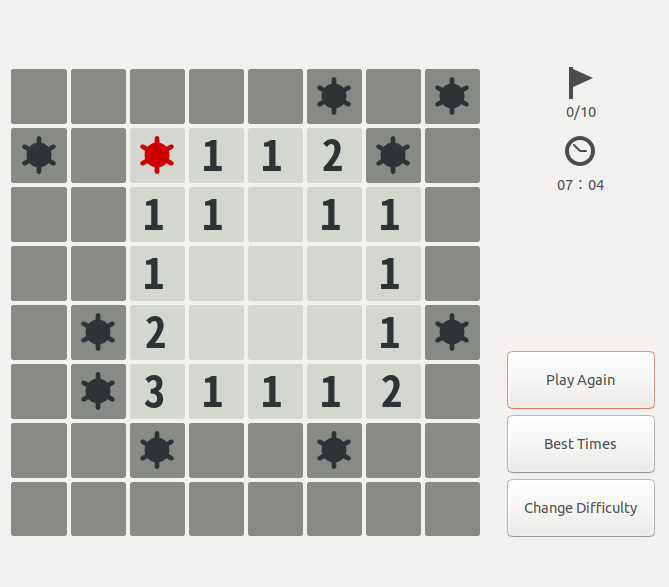
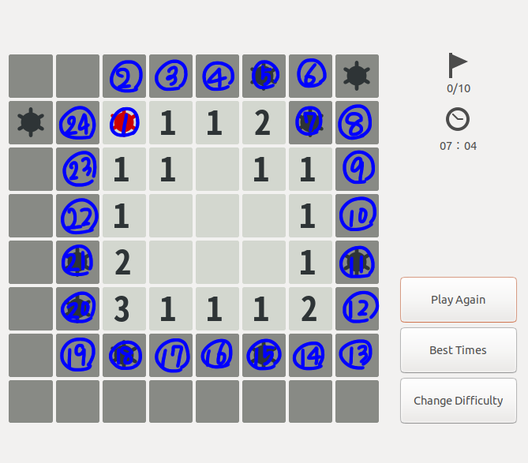

# マインスイーパー解析

## test.py

マインスイーパーの数字があるところを

2行3列目の「1」から時計回りに順に
$b_i(1\leq i \leq 16)$
とし、

下図の青色の数字が振ってあるところを番号に沿って $x_j(1\leq j\leq 24)$
- 地雷がある場合 : $x_j = 1$
- 地雷がない場合 : $x_j = 0$

とおくと

$$
x_1 + x_1 + x_1 + x_1 = b_1 = 1 \\
x_3 + x_4 + x_5 = b_2 = 1 \\
... \\
x_{17} + x_{18} + x_{19} + x_{20} + x_{21} = b_{12} = 3 \\
... \\
$$
これらを行列にまとめる

$$
A \cdot X = B
$$
あとは掃き出し法なりで$x_j$を計算する
|$j$| $x_j$|bomb|   |$j$| $x_j$|bomb|
|---|  --- |--- |---|---|  --- |--- |
| 1 |  1.00| *  |   |13 |  0.35|    |
| 2 | -0.25|    |   |14 |  0.44|    |
| 3 | -0.25|    |   |15 |  0.44| *  |
| 4 |  0.50|    |   |16 |  0.12|    |
| 5 |  0.75| *  |   |17 |  0.44|    |
| 6 |  0.75|    |   |18 |  0.44| *  |
| 7 |  1.00| *  |   |19 |  0.41|    |
| 8 | -0.19|    |   |20 |  0.85| *  |
| 9 |  0.19|    |   |21 |  0.85| *  |
|10 |  0.23|    |   |22 |  0.29|    |
|11 |  0.58| *  |   |23 | -0.15|    |
|12 |  0.19|    |   |24 | -0.15|    |

## 課題
- $x_i$の値が正になるとは限らない
    - 共役勾配法だと正になる(?)
-  $x_i$の値が0,1にならない
- 機械学習の方が楽説
